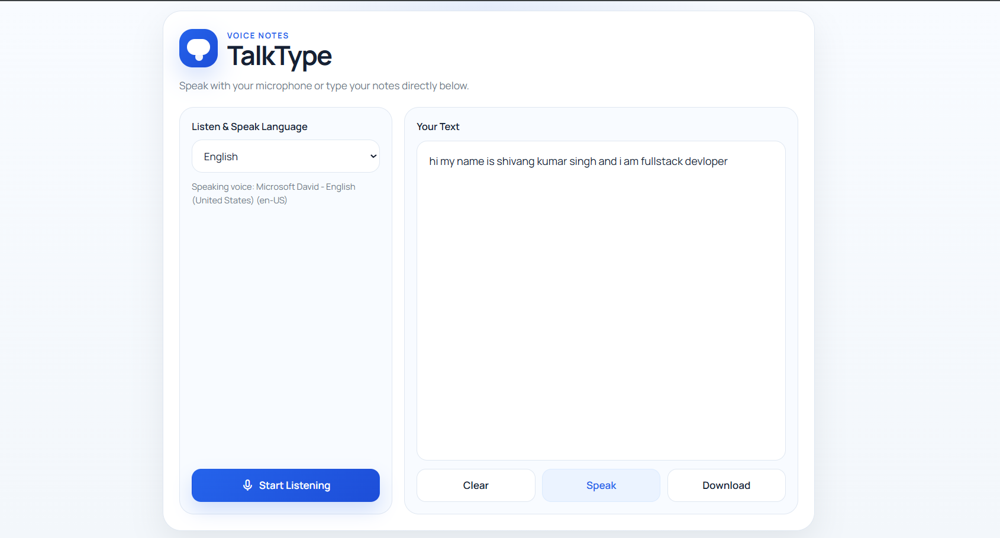

# 🎤 TalkType - Speech To Text Website

A speech-to-text web application built using JavaScript and the Web Speech API.

## 📸 Preview

---

## ✨ Features

- 🎙️ Speech Recognition
- 📝 Real-Time Voice To Text
- 🌐 Language Selection
- 💾 Download Notes
- 📱 Responsive Design

---

## 🛠️ Technologies Used

- HTML5
- CSS3
- JavaScript
- Web Speech API

---

## 🚀 How To Use

1. Select your language.
2. Click Start Listening.
3. Speak into your microphone.
4. Your speech will be converted into text.
5. Download your notes if needed.

---

## 👨‍💻 Author

Shivang Kumar
